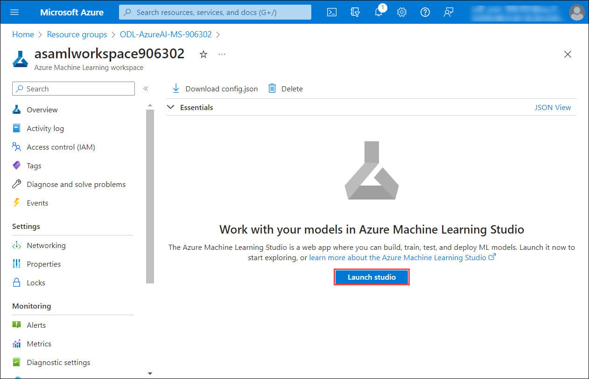
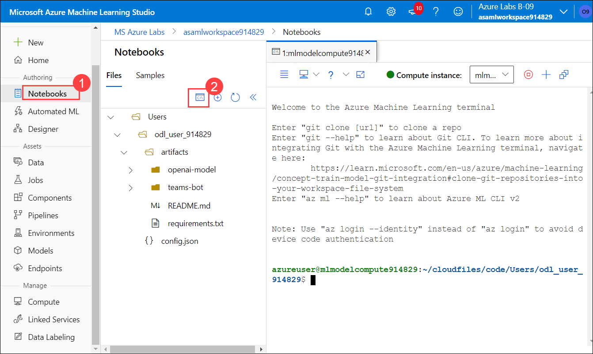
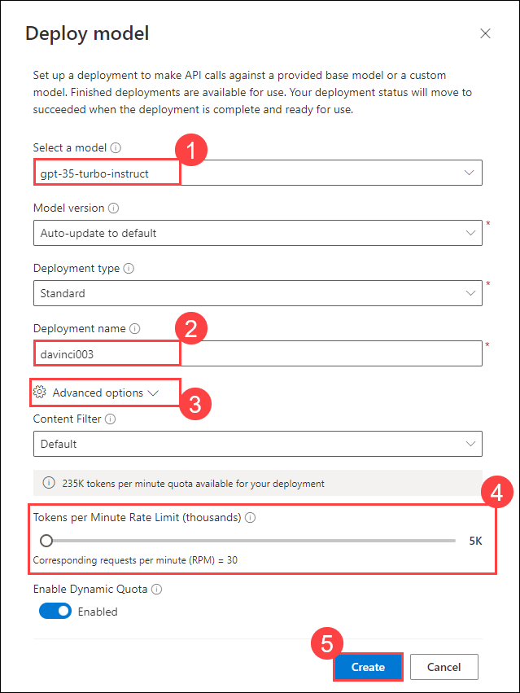
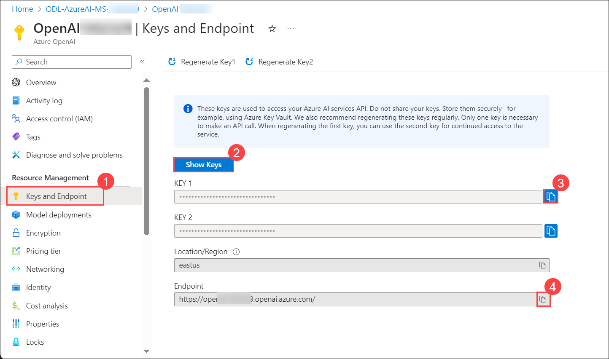

## Exercise 1: Leveraging an OpenAI model to create extract data and create embeddings

In this exercise, you will be installing the required packages from the Machine learning studio. You will also be deploying the Model in Open AI by running the Python notebook from the Machine learning studio

### Task 1: Install all the required libraries using the requirements.txt file


1. In Azure Portal, on the **Search resources, services, and docs** search for **Resource groups (1)**, and click on **Resource groups (2)**.

   

1. From the Resource groups page, click on **ODL-AzureAI-MS-<inject key="DeploymentID" enableCopy="false"/>**.

   

1. From the **Overview (1)** tab select the Azure Machine Learning workspace **asamlworkspace<inject key="DeploymentID" enableCopy="false"/> (2)**.

   
   
1. On Azure Machine Learning workspace click on **Launch studio**.

   

1. On Microsoft Azure Machine Learning Studio Click on **Notebooks (1)** and click on **Open Terminal (2)** and run the below-mentioned commands

    ```
    cd artifacts/openai-model
    ```

    ```
    pip install enum34
    pip install cmdstanpy==0.9.5
    ```
   
    ```
    pip install --upgrade -r requirements.txt
    ```
    
    ```
    pip install --upgrade pip
    ```
    
    ```
    pip install numpy==1.23.5
    ```
    
    
    
    

    > **Note**: If you encounter **ERROR: pip's dependency resolver does not currently take into account all the packages that are installed**, please ignore it and continue.

1. Now you need to restart the compute instance after installing the required packages. Follow the below steps to restart the compute instance:

   -  Select **Compute (1)** under Manage
   -  Choose the pre-deployed compute instance **mlmodelcompute<inject key="DeploymentID" enableCopy="false"/> (2)**
   -  Click on **Restart (3)**

      

      >**Note:** Wait for the restart to be completed.
   
### Task 2: Update the configuration file with newly generated credentials

1. Navigate back to the Azure Portal and from the **Overview (1)** page of the resource group select Azure Open AI **OpenAI<inject key="DeploymentID" enableCopy="false"/> (2)**.

    
    

1. On the OpenAI **Overview (1)** page and right-click on **Go to Azure OpenAI Studio (2)** button and click on **Open link in new tab**.

   

1. In the **Azure OpenAI Studio**, select **Deployments (1)** under Management and click on **+ Create new deployment (2)**.

   

1. On the Deploy model pop-up, from the drop-down select **text-embedding-ada-002 (1)** for Select a Model, enter the deployment name as **ada002 (2)**, expand **Advanced options (3)** and scale down the **Tokens per Minute Rate Limit (thousands) (4)** to **5k** then click on **Create (5)**.

   

1. Click on **+ Create new deployment**, On the Deploy model pop-up, from the drop-down select **gpt-35-turbo-instruct (1)** for Select a Model, enter the deployment name as **davinci003 (2)**, expand **Advanced options (3)** and scale down the **Tokens per Minute Rate Limit (thousands) (4)** to **5k** then click on **Create (5)**.

   

1. Now navigate back to the Azure portal, click on **Keys and Endpoints (1)**, select **Show Keys (2)**, and copy the values of **Key 1 (3)** and **Endpoint (4)** in a notepad. You will be using these values in the next steps.

   
    
1. Navigate to Azure Machine Learning Studio, click on **Notebooks** and expand **Openai-model (1)** folder then click on **config.json (2)**.

   
  
1. Follow the below instructions to replace the values:

   - **API_KEY**: Enter the value of **Key (1)** of Open AI you have copied in step-2
   - **API_BASE**: Enter the value of **Endpoint (2)** of Open AI you have copied in step-2
   - **COGNITIVE_API_KEY**: Enter the value **<inject key="SearchService Key" enableCopy="true"/> (3)**
   - **CONNECTION_STRING**: Enter the value **<inject key="StorageAccountConnectionString" enableCopy="true"/> (4)**
   - **COGNITIVE_SEARCH_NAME** Enter the Value **<inject key="SearchService Name" enableCopy="true"/> (5)**
   - **COGNITIVE_ENDPOINT** Enter the Value **<inject key="SearchService Endpoint" enableCopy="true"/> (6)**

      
   
1. Select on **Save (2)**.

   
   
### Task 3: Experiment with notebooks to explore data and model

1. Navigate to the **notebooks** folder, open **create-services.py** file from the path **Users/odl_user_<inject key="DeploymentID" enableCopy="false"/>/artifacts/openai-model**

    

1. Select on **Save and run script in terminal**.

   
    
   > **Info:** This will open a  new terminal window and will run the file. 
     
1. Navigate to the **notebooks** folder, open **dataextraction.py** file from the path **Users/odl_user_<inject key="DeploymentID" enableCopy="false"/>/artifacts/openai-model**

    

1. Select on the eclipse **(...)** **(1)** and click on **Save and run script in terminal (2)**.

   
    
   > **Info:** This will open a  new terminal window and will run the file. 
  
1. Navigate back to the **openai-model** folder, select **faq.ipynb (1)** file and select the kernal as **Python 3.8-AzureML (2)**.

   
   
1. Run each cell one after the other and observe the output.

   
   
 ## Summary

* In this exercise, you have installed the required packages from the Machine learning studio and deployed the Model in Open AI by running the Python notebook from the Machine learning studio.

