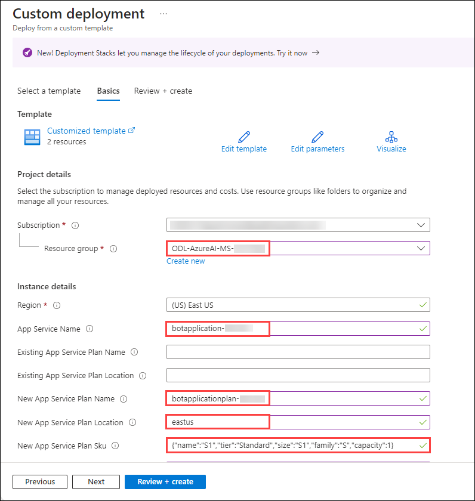
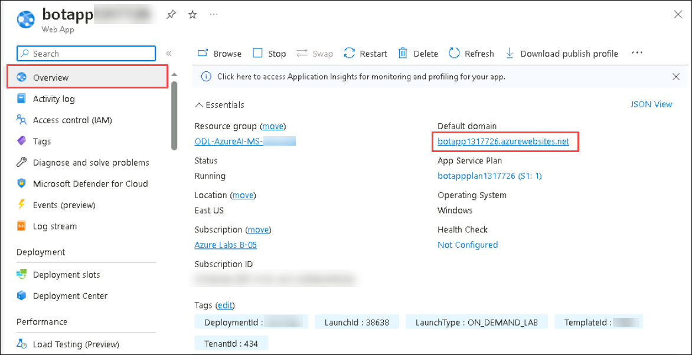
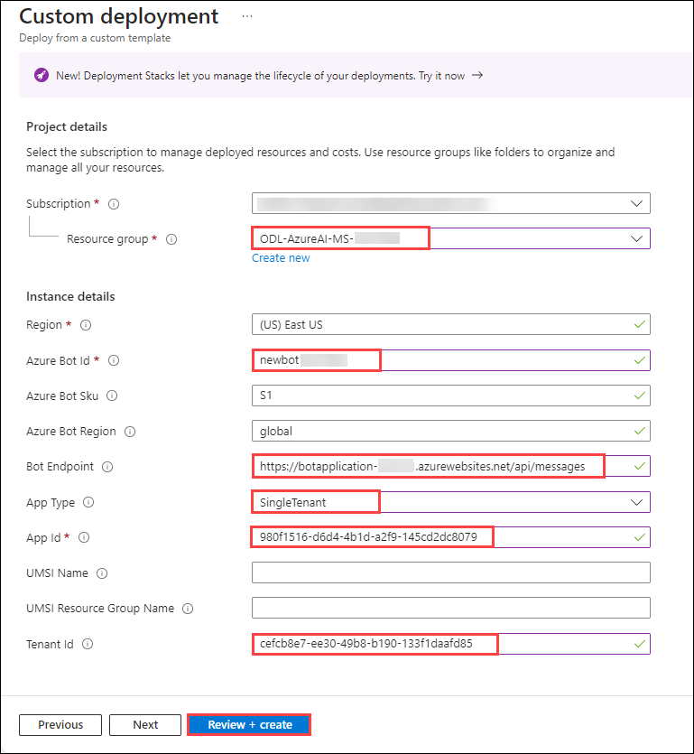
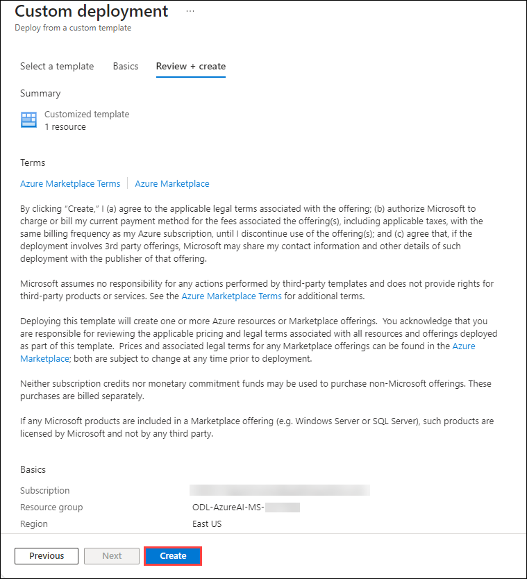
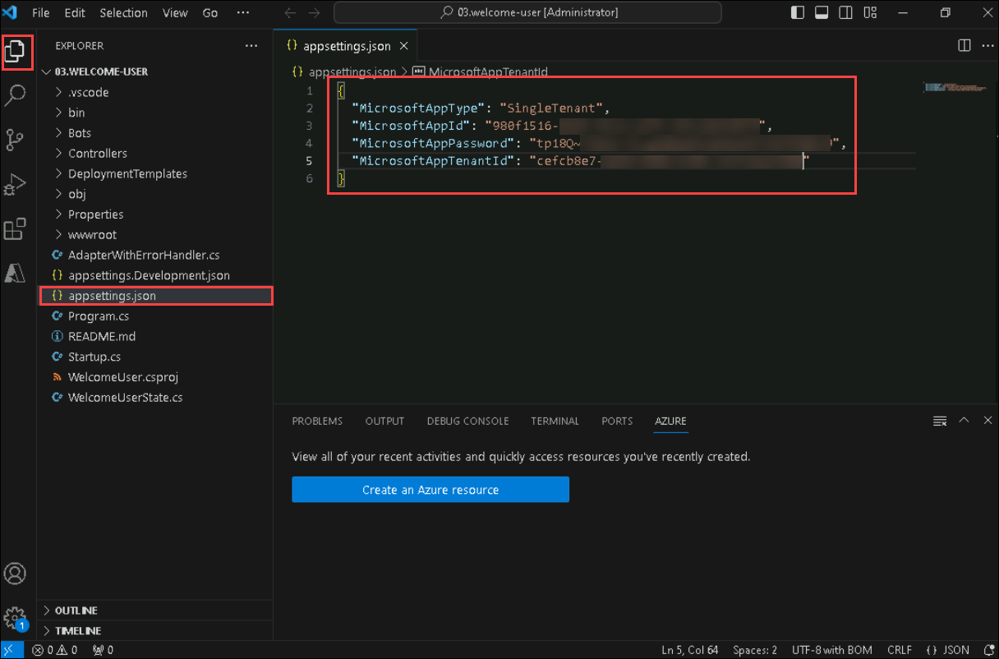
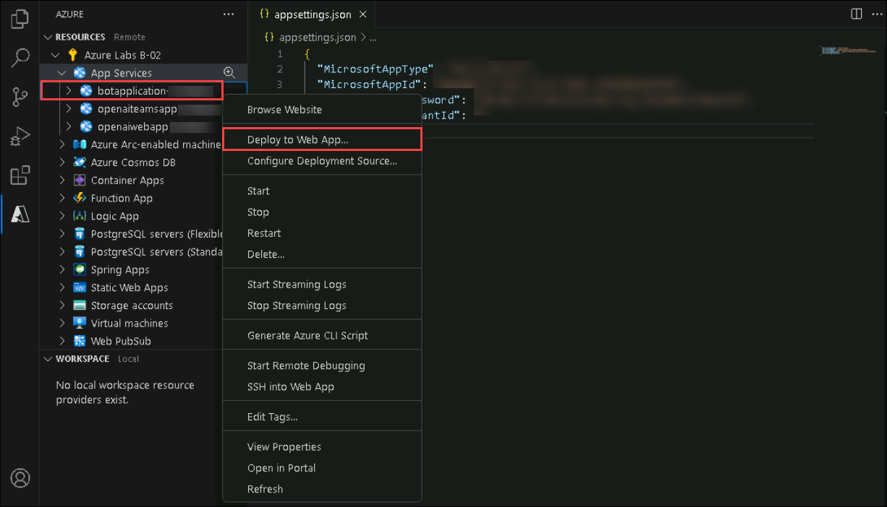
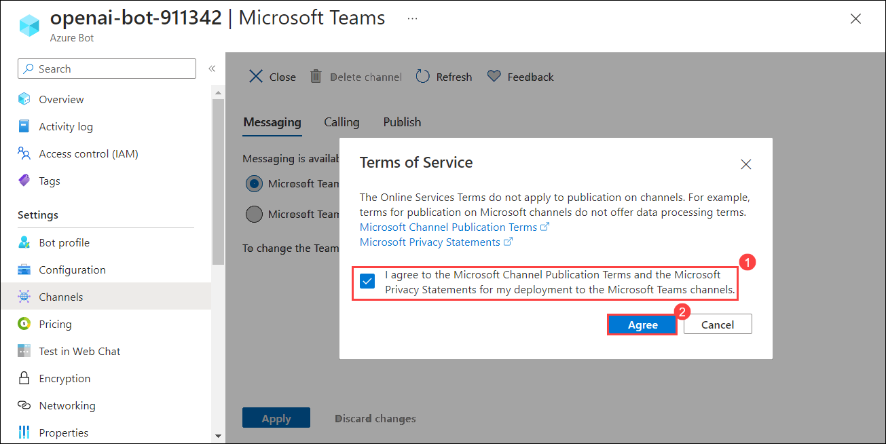

## Exercise 3. Deploying the chatbot on Azure Bot Service and Azure App Service.

In this exercise, you will be deploying the chatbot code to the app service and will connect it to the Azure Bot, later you will be integrating it will the MS team.

### Task 1: Clone the github repo to deploy chatbot

1. Search **Command Prompt** from the search bar of windows and select it.

    

2. Run the below command to navigate to the path to clone the repo.

    ```
    cd C:\LabFiles
    ```
3. Run the below command to clone the repo.

    ```
    git clone https://github.com/CloudLabsAI-Azure/BotBuilder-Samples
    ```

### Task 2: Deploy Azure App service using ARM template

1. Open your web browser and navigate to the Azure Portal. Sign in with your Azure account if you are not logged in.

2. Search and select **Deploy from a custom template**

    

3. Click on **Build your own template in the editor** from the Custom deployment tab.

    

4. Click on **Load file** from the Edit template tab.

    

5. Navigate to **C:\LabFiles\BotBuilder-Samples\samples\csharp_dotnetcore\03.welcome-user\DeploymentTemplates\DeployUseExistResourceGroup\** select **template-BotApp-with-rg.json** and click on save.

6. On  the **Custom deployment** tab specify the following settings (leave others with their defaults) and select **Review + create**:  

    | Setting | Value |
    | --- | --- |
    | App Service Name | **botapplication-<inject key="DeploymentID" enableCopy="false"/>**  |
    | New App Service Plan Name | **botapplicationplan-<inject key="DeploymentID" enableCopy="false"/>** |
    | New App Service Plan Location | **Same as resource group** |
    | New App Service Plan Sku | **Keep it default** |
    | App Type | **SingleTenant** |
    | App Id   | **Enter Application Id value from Service Principal Details** |
    | App Secret | **Enter Secret Key value from Service Principal Details** |
    | Tenant Id | **Enter Tenant Id value from Service Principal Details** |
    

    

    

    

7. Click on **Create** button.

    

8. After the app service got deployed, from the resource group select the Web app and from the overview tab copy default domain name and paste it into notepad. You will need it in further exercise.

    

### Task 3: Deploy Azure bot service using ARM template

1. Search and select **Deploy from a custom template**

    

2. Click on **Build your own template in the editor** from the Custom deployment tab.

    

3. Click on **Load file** from the Edit template tab.

    

4. Navigate to **C:\LabFiles\BotBuilder-Samples\samples\csharp_dotnetcore\03.welcome-user\DeploymentTemplates\DeployUseExistResourceGroup\** select **template-AzureBot-with-rg.json** and click on save.

5. On  the **Custom deployment** tab specify the following settings (leave others with their defaults) and select **Review + create**:  

    | Setting | Value |
    | --- | --- |
    | Azure Bot Id | **newbot<inject key="DeploymentID" enableCopy="false"/>** |
    | Bot Endpoint | **https://<appServiceName>.azurewebsites.net/api/messages** (replace appServiceName with the app name which you have deployed) |
    | App Type | **SingleTenant** |
    | App Id   | **Enter Application Id value from Service Principal Details** |
    | Tenant Id | **Enter Tenant Id value from Service Principal Details** |

    

    

7. Click on **Create** button.

    


### Task 4: Update the configuration file with newly generated credentials

1. Navigate back to the Visual Studio code and follow the below instructions to update the values in the .env file.

    - Click on **Explorer (1)**
    - Select **appsettings.json (4)** file.

    
        
1. Replace the values in the **appsettings.json** file, you can obtain the values from **Environment Details (1)** page, under **Service Principal Details (2)**. 

     - **MicrosoftAppType**= **SingleTenant**
     - **MicrosoftAppId**= Enter **Application Id (3)** value from Service Principal Details
     - **MicrosoftAppPassword**= Enter **Secret Key (4)** value from Service Principal Details
     - **MicrosoftAppTenantId**= Enter **Tenant Id (Directory id) (5)** value from Service Principal Details

          

1. After updating the values, save the file by clicking **ctrl + S**

### Task 5: Deploy the chatbot on Azure Bot Service and Azure App Service

1. Follow the below-mentioned instructions to deploy the web app:

    - Click on **Azure (1)**
    - Expand **Resources (2)**
    - Expand the assigned **Subscription (3)**
    - Right-click on ****botapplication-<inject key="DeploymentID" enableCopy="false"/>** (4)**
    - Click on **Deploy to Web App (5)**.

    

2. Click on **Browse**.

       
   
3. Navigate to the path **C:\LabFiles\BotBuilder-Samples\samples\csharp_dotnetcore** and select **03.welcome-user\** then click on **Ok (2)**.   
    
4. On the Visual Studio Code pop click on **Add Config**

    
    
5. On the pop up **Are you sure you want to deploy to "botapplication-<inject key="DeploymentID" enableCopy="false"/>"?** click on **Deploy**.

    
    
6. Make sure that the deployment is completed on the web app.

    
       
    > **Note:** Wait for 10-15 minutes until the deployment is completed.
    
    > **Note:** If you encounter a deployment failure with error: (intermediate value).parsedBody.map is not a function you can ignore it and continue with the next task.  
    
### Task 4: Publish the chatbot on the Microsoft Teams channel using a manifest file

1. Navigate back to the Azure portal and from the Overview page of the resource group select Azure Bot **openai-bot-<inject key="DeploymentID" enableCopy="false"/>**.

    
    
1. On the Azure bot page, follow the below-given instructions:

    - Click on  **Configuration (1)**
    - Message endpoint : Enter **https://botapplication-<inject key="DeploymentID" enableCopy="false"/>.azurewebsites.net/api/messages**
    - Click on **Apply (3)**

    

    > **Note:** If the message endpoint is already updated with the web app name then skip this step.

1. Click on **Channels (1)** and scroll down to Available channels and select **Microsoft Teams (2)**.

    
    
1. Check the box next to **I agree to the Microsoft Channel Publication Terms and the Microsoft Privacy Statements for my deployment to the Microsoft Teams channels** and click on  **Agree (2)**.

    
    
1. Leave everything as default on the Microsoft Teams page and click on **Apply**.

    
    
1. Once the changes are applied successfully, click on **Close**.

    
    
1. You can view Microsoft Teams under Channels. Now click on **Open in Teams** URL to open the application.

    
    
1. On **Microsoft Teams** window, select **Use web app instead**.

    
    
1. Send a message **Hi** in the chat **botapplication-<inject key="DeploymentID" enableCopy="false"/>**, you will see a response from the chatbot and explore through the available chatbot options.

    
    
The lab ends here. You have learned how to work with Azure OpenAI and integrate it with your knowledge base. 
